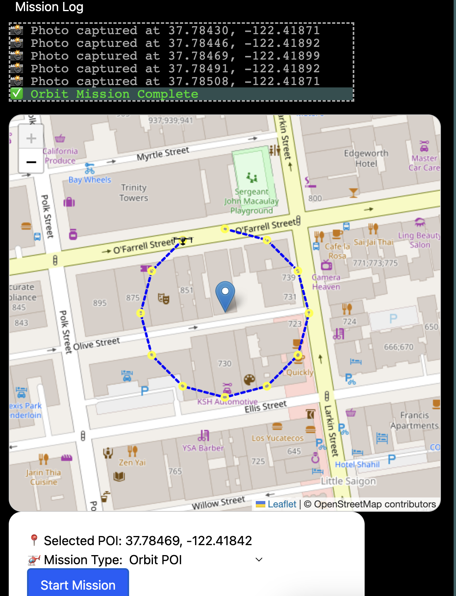

### WIP

<h3>DroneMission Component: Mission Builder</h3>
 
This repository tracks the development of a component for integration into the DroneMission project.
 
https://github.com/RydCri/DroneMission/
 
This component provides users of the webapp with tools to:
 

<ul>
<li>Sync drones using MAVProxy and Ardupilot.</li>
<li>Choose autonomous flight missions.</li>
<li>Output files based on mission type.</li>
</ul>
 
Your Drone will be connected by wifi to your ground station device where you will be able to build and task your drone for the desired missions.
 
The application's focus is on generating maps, orthomosaics, and photogrammetry (3D models) using FPV and gimbal camera drones.
 

 
<i>Flight Mission Demo</i>
 

