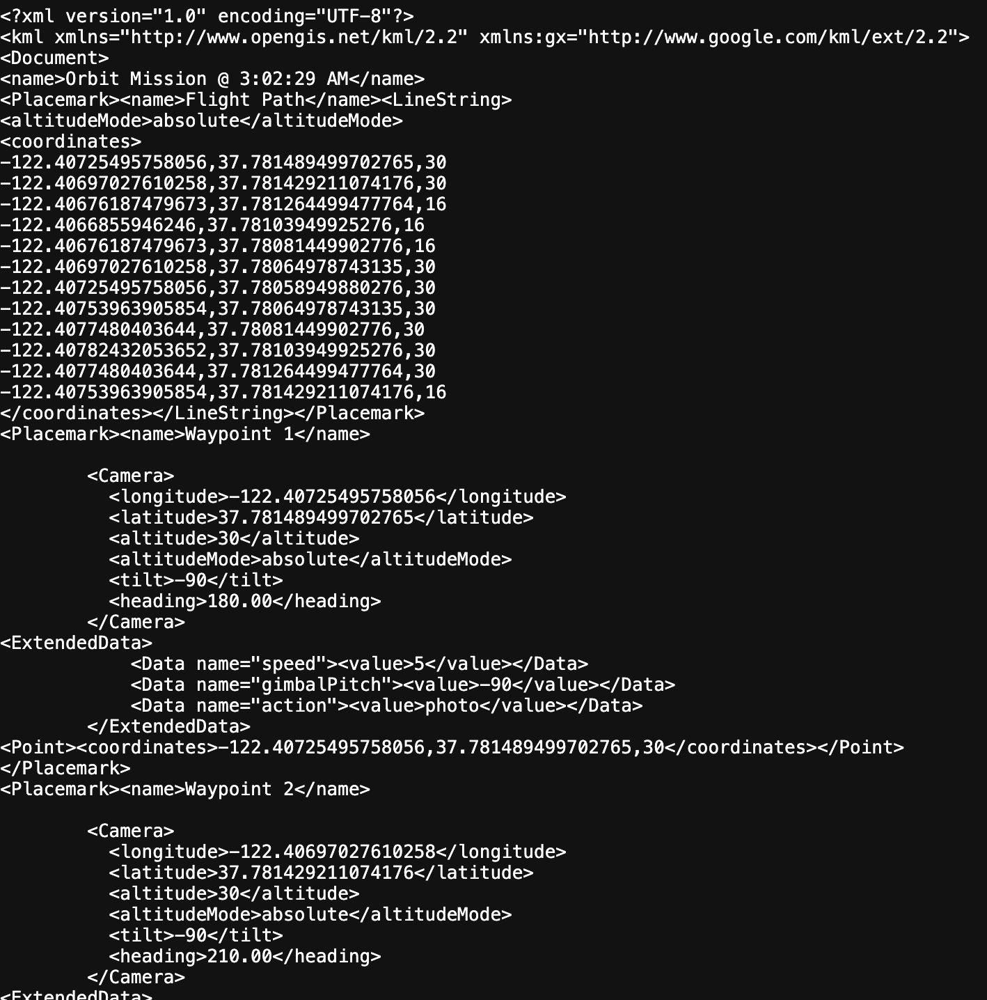
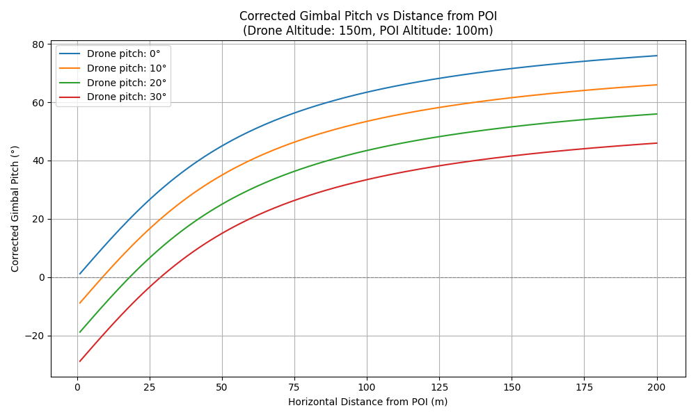

### WIP

<h3>DroneMission Component: Mission Builder</h3>
 
This repository tracks the development of a component for integration into the DroneMission project.
 
https://github.com/RydCri/DroneMission/
 

 
<i>Flight Mission Demo</i>
 
 
This app provides users of the webapp with tools to:
 

<ul>
<li>Build flightpath waylines around points of interest.</li>
<li>Customize for use-case (alt adjustments, image overlay).</li>
<li>Export flight as .kmz file for easy integration into compatible FCS.</li>
<li>Turn collected flight photos into usable projects.</li>
</ul>
 
This app's focus is on generating maps, orthomosaics, and photogrammetry using FPV and gimbal camera drones.
 

The app is intended for use with off-the-shelf dronekits that support mission planning through tools like DJI Pilot, QGroundControl, or Mission Planner.

Build a mission and export as a .kml file, a popular format for pre-planned drone flight missions.

 

 
<i>A single grid flight can collect photos usable for projects in basic photogrammetry like Digital Surface Models (DSM) or Digital Elevation Models (DEM)</i>

### Gimbal camera settings

Using the default camera setting will set the camera gimbal at an angle to keep the point of interest in frame during the flightpath

This angle is reckoned based off the distance of the waypoint from POI, altitude of drone and altitude of POI. <i>default 1 meter</i>

 
<h3>Important:</h3>

Flight .kml(s) are not dynamic and high speed can throw POI off frame between waypoints.

Recommended you assume 2.5 m/s as your 'safe' speed for photogrammetry.

 

Your drone's ability to keep a POI in frame is based off its own camera stabilization tools or a mission executor that takes your drone's IMU to compensate drone pitch with gimbal pitch.

| Drone Type                            | Safe Orbit Speed | Notes                                      | 
|---------------------------------------|------------------|--------------------------------------------|
| Cine drones (DJI Mavic, Air, Phantom) | 1.5 – 4 m/s      | Smooth gimbal, good stabilization          |
| FPV drones (fixed camera)             | 1 – 2 m/s        | Must go slower; camera can't compensate    |
| Cinematic Look (Slow orbit)           | 0.5 – 1.5 m/s    | Best for interviews, real estate           |
| Fast tracking (Dynamic action)        | 4 – 6 m/s        | Requires 60fps+ capture, high gimbal skill |