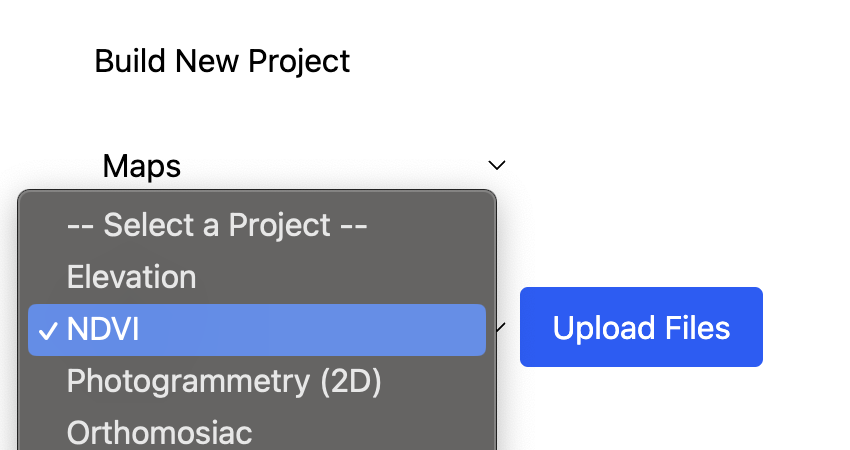

### WIP

<h3>DroneMission Component: Mission Builder</h3>
 
This repository tracks the development of a component for integration into the DroneMission project.
 
https://github.com/RydCri/DroneMission/
 
This component provides users of the webapp with tools to:
 

<ul>
<li>Build flightpath waylines around points of interest.</li>
<li>Customize for use-case (alt adjustments, image overlay).</li>
<li>Export flight as .kmz file for easy integration into compatible FCS.</li>
<li>Turn collected flight photos into usable projects.</li>
</ul>
 
This app's focus is on generating maps, orthomosaics, and photogrammetry using FPV and gimbal camera drones.
 

 
<i>Flight Mission Demo</i>
 

The app is intended for use with off-the-shelf dronekits that support mission planning through tools like DJI Pilot, QGroundControl, or Mission Planner.

Once mission is complete: collected files will be uploadable to build projects related to mission type.

 
<i>A single grid flight can collect photos usable for projects in basic photogrammetry like Digital Surface Models (DSM) or Digital Elevation Models (DEM)</i>

